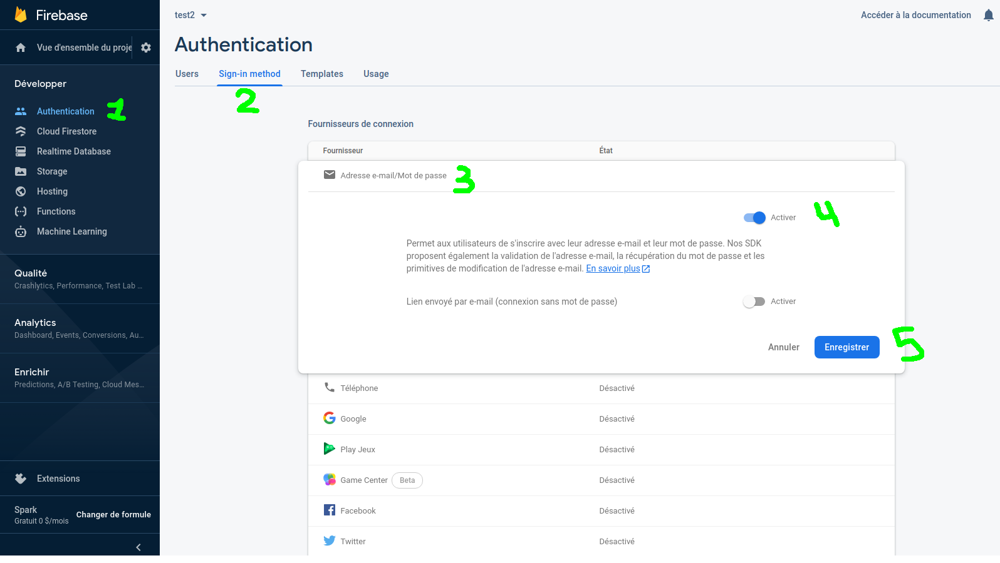

# Workshop Nativescript

Bonjour à tous,

Pour ce workshop vous aurez besoin d'un Smartphone (Apple ou Android, au choix) branché a votre pc et installer les applications suivantes:

- Nativescript Playground qui vous permettra de scanner le QR code pour linker votre application en développement a votre Smartphone
- Nativescript Preview qui vous permettra d'afficher le rendu de l'application développée

Vous pouvez voir le rendu de votre application de 2 manières:

- En effectuant un tns preview, vous scannez le QR code avec l'application Preview et votre code sera affiché sur votre smartphone
- En effectuant un tns run (android ou ios) --bundle, le CLI scannera tout les devices connectés a votre machine et simulera l'application dessus. Ceci nécéssite un smartphone en mode developpeur (Cliquer plusieurs fois sur la version de votre smartphone dans les paramètres) branché a votre pc ainsi que le Débuggage USB (options développeurs) activé.

L'**installation** de tout l'environnement travail :

- Premièrement, il vous faudra Nativescript.

```bash
  npm install -g nativescript
```

- Verifiez l'installation

```bash
  tns doctor
  tns create testapp
  cd testapp
  tns run android #ios depending on your smartphone
```

- Ensuite, vous aurez besoin de Vue CLI

```bash
  npm install -g @vue/cli @vue/cli-init
  vue init nativescript-vue/vue-cli-template loginApp
```

- Lancez la compilation

```bash
  cd loginApp
  npm install
  tns run android --bundle #ios depending on your smartphone
```

Un autre point assez important, Nativescript peut s'utiliser avec plusieurs _Frameworks_ ou _Supersets_, les plus populaires étant React et Typescript. Pour ce workshop nous utiliserons **VueJS**.

[Documentation Nativescript VueJS](https://nativescript-vue.org/en/docs/introduction/)

Il est possible de se passer de son Smartphone en utilisant des emulateurs, ceux-ci étant long à installer. Je ne m'attarderai pas sur l'installation et la configuration de ceux-ci dans mon workshop, mais dans le cas ou vous voudriez continuer à travailler avec un émulateur par la suite, n'hésitez pas a me demander.

## L'application

Nous allons développer une application de login simple.

Premièrement nous allons créer un fichier nommé LoginPage.vue dans /app/components. Celle-ci contiendra la suite:

```html
<template>
  <Page>
    <FlexboxLayout class="page">
      <StackLayout class="form">
        <image class="logo" src="~/images/logo.png" />
        <label class="header" text="LOGIN APP" />

        <StackLayout class="input-field" marginBottom="25">
          <TextField
            class="input"
            hint="Email"
            keyboardType="email"
            autocorrect="false"
            autocapitalizationType="none"
            v-model="user.email"
            returnKeyType="next"
            @returnPress="focusPassword"
            fontSize="18"
          />
          <StackLayout class="hr-light" />
        </StackLayout>

        <StackLayout class="input-field" marginBottom="25">
          <TextField
            ref="password"
            class="input"
            hint="Password"
            secure="true"
            v-model="user.password"
            :returnKeyType="isLoggingIn ? 'done' : 'next'"
            @returnPress="focusConfirmPassword"
            fontSize="18"
          />
          <StackLayout class="hr-light" />
        </StackLayout>

        <StackLayout v-show="!isLoggingIn" class="input-field">
          <TextField
            ref="confirmPassword"
            class="input"
            hint="Confirm Password"
            secure="true"
            v-model="user.confirmPassword"
            returnKeyType="done"
            fontSize="18"
          />
          <StackLayout class="hr-light" />
        </StackLayout>

        <button
          :text="isLoggingIn ? 'Log In' : 'Sign up'"
          @tap="submit"
          class="btn btn-primary m-t-20"
        />

        <label
          v-show="isLogginIn"
          text="Forgot your password ?"
          class="login-label"
          @tap="forgotPassword"
        />
      </StackLayout>

      <label class="login-label sign-up-label" @tap="toggleForm">
        <FormattedString>
          <span
            :text="isLoggingIn ? 'Don´t have an account ?' : 'Back to Login'"
          />
          <span :text="isLoggingIn ? 'Sign up' : ''" class="bold" />
        </FormattedString>
      </label>
    </FlexboxLayout>
  </Page>
</template>

<script>
  const userService = {
    register(user) {
      return Promise.resolve(user);
    },
    login(user) {
      return Promise.resolve(user);
    },
    resetPassword(email) {
      return Promise.resolve(email);
    },
  };

  const HomePage = {
    template: `
        <Page>
            <Label class="m-20" textWrap="true" text="You have succesfully authenticated. This is where you build your code application functions" />
        </Page>
        `,
  };

  export default {
    data() {
      return {
        isLoggingIn: true,
        user: {
          email: "foo@foo.com",
          password: "foo",
          confirmPassword: "foo",
        },
      };
    },
    methods: {
      toggleForm() {
        this.isLoggingIn = !this.isLoggingIn;
      },

      submit() {
        if (!this.user.email || !this.user.password) {
          this.alert("Please provide both an email adress and password.");
          return;
        }
        if (this.isLoggingIn) {
          this.login();
        } else {
          this.register();
        }
      },

      login() {
        userService
          .login(this.user)
          .then(() => {
            this.$navigateTo(HomePage);
          })
          .catch(() => {
            this.alert("Unfortunately we could not find your account.");
          });
      },

      register() {
        if (this.user.password != this.user.confirmPassword) {
          this.alert("Your password do not match.");
          return;
        }
        userService
          .register(this.user)
          .then(() => {
            this.alert("Your account was successfully created.");
            this.isLoggingIn = true;
          })
          .catch(() => {
            this.alert("Unfortunately we were unable to create your account.");
          });
      },

      forgotPassword() {
        prompt({
          title: "Forgot Password",
          message:
            "Enter the email address you used to register for LOGIN APP to reset your password.",
          inputType: "email",
          defaultText: "",
          okButtonText: "Ok",
          cancelButtonText: "Cancel",
        }).then((data) => {
          if (data.result) {
            userService
              .resetPassword(data.text.trim())
              .then(() => {
                this.alert(
                  "Your password was successfully reset. Please check your email for instructions on choosing a new password."
                );
              })
              .catch(() => {
                this.alert(
                  "Unfortunately, an error occurred resetting your password."
                );
              });
          }
        });
      },

      focusPassword() {
        this.$refs.password.nativeView.focus();
      },

      focusConfirmPassword() {
        if (!this.isLogginIn) {
          this.$refs.confirmPassword.nativeView.focus();
        }
      },

      alert(message) {
        return alert({
          title: "LOGIN APP",
          okButtonText: "Ok",
          message: message,
        });
      },
    },
  };
</script>

<style scoped>
  .page {
    align-items: center;
    flex-direction: column;
  }

  .form {
    margin-left: 30;
    margin-right: 30;
    flex-grow: 2;
    vertical-align: middle;
  }

  .logo {
    margin-bottom: 12;
    height: 90;
    font-weight: bold;
  }

  .header {
    horizontal-align: center;
    font-size: 25;
    font-weight: 600;
    margin-bottom: 70;
    text-align: center;
    color: #d51a1a;
  }

  .input-field {
    margin-bottom: 25;
  }

  .input {
    font-size: 18;
    placeholder-color: #a8a8a8;
  }

  .input-field .input {
    font-size: 54;
  }

  .btn-primary {
    height: 50;
    margin: 30 5 15 5;
    background-color: #d51a1a;
    border-radius: 5;
    font-size: 20;
    font-weight: 600;
  }

  .login-label {
    horizontal-align: center;
    color: #a8a8a8;
    font-size: 16;
  }

  .sign-up-label {
    margin-bottom: 20;
  }

  .bold {
    color: #000000;
  }
</style>
```

Ensuite modifiez le fichier app/main.js pour qu'il ressemble à ceci:

```javascript
import Vue from "nativescript-vue";
import VueDevtools from "nativescript-vue-devtools";
import LoginPage from "./components/LoginPage";

if (TNS_ENV !== "production") {
  Vue.use(VueDevtools);
}
// Prints Vue logs when --env.production is *NOT* set while building
Vue.config.silent = TNS_ENV === "production";

new Vue({
  render: (h) => h("frame", [h(LoginPage)]),
}).$start();
```

Après celà, vous pouvez regarder votre smartphone.

Vous obtiendrez une page de login qui vous permet de simuler:

- une action de login en entrant un nom d'utilisateur et un mot de passe.
- une action de register en entrant un nom d'utilisateur, password et une confirmation de mot de passe.
- une action de mot de passe oublié qui ouvrira une modale.

## Firebase

Pour le back-end nous utiliserons [Firebase](console.firebase.google.com), qui nous propose une api d'authentification toute faite!

- Creez vous un compte firebase.
- Creez un projet 
- Ajoutez les platformes IOS et Android en cliquant sur leurs icones respectifs.
- Ajoutez l'identifiant unique du groupe correspondant (ex: com.workshop.loginapp)
- Téléchargez le fichier de configuration
- Ajoutez les fichiers dans /app/App_Resources/ soit Android soit IOS en fonction du fichier.
- Activez le service d'authentification par email/password dans la console firebase 

Ensuite installez le plugin Nativescript pour Firebase

```bash
  tns plugin add nativescript-plugin-firebase
```

Il vous demandera pendant l'installation quels services vous voulez activer. Pour cette application nous auront besoin de iOS, Android, Firebase, Authentification, Firebase Facebook Authentication et Firebase Google Authentification.

Au cas ou, lancez cette commande pour mettre a jour le repository cocoapod

```bash
pod repo update
```
